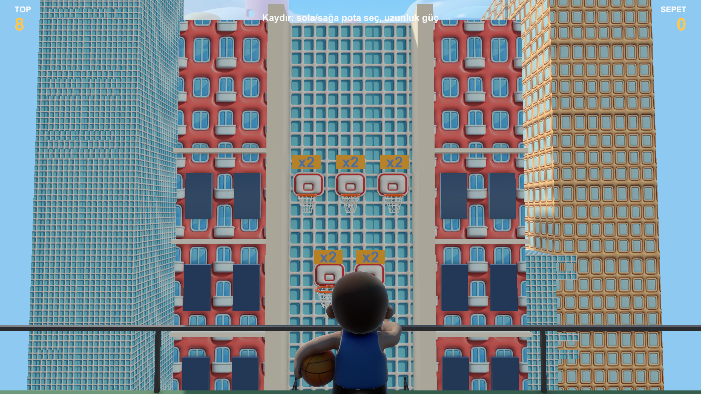
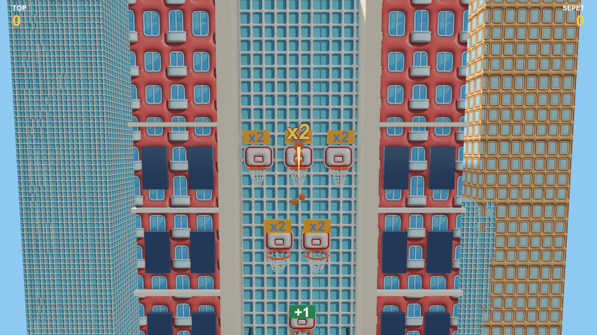
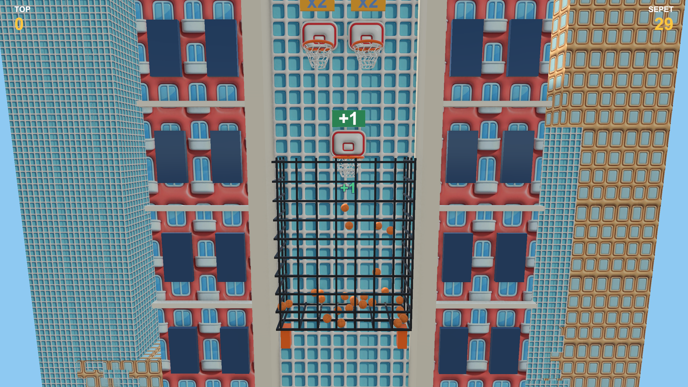
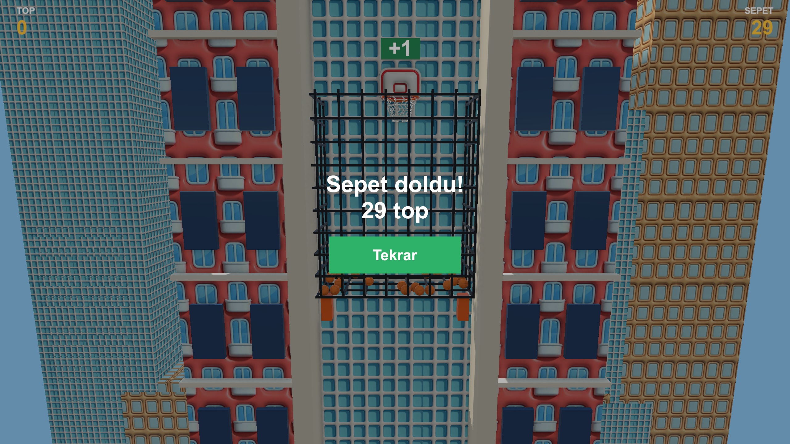

# Unity MCP Playground

A Unity 6 / URP project set up so that an **AI coding agent drives the running Unity Editor** through an MCP (Model Context Protocol) bridge — building scenes, authoring prefabs and effects, reading the console, running tests and taking screenshots, instead of only writing `.cs` files and hoping they compile.

It is also a real thing built that way: a complete, playable **basketball round** rebuilt in 3D from a 2D three.js original, including physics, camera, juice, HUD, tests, and a programmatic shot-sweep tool used to verify that the rebuild's difficulty matches the original's measured numbers.



| Flight | Drop | Result |
|---|---|---|
|  |  |  |

---

## What's interesting here

- **A working agent ⇄ Editor loop.** The [MCP for Unity](https://github.com/CoplayDev/unity-mcp) bridge is vendored into `Packages/` and auto-started on every editor launch and domain reload, so an MCP client (Claude Code, Cursor, …) can reach the editor at `http://localhost:8080/mcp` without anyone clicking a button.
- **A Unity 6.6 compatibility patch** for that bridge (see [below](#unity-66-compatibility-patch)) — without it, every tool that targets an existing object fails.
- **A project-specific tool layer** (`AI Tools/…`): bulk rename, bulk material assignment, prefab-from-selection, scatter, missing-reference and pink-material audits, VFX starters, plus the basket-specific scene builder and shot sweeper. Each one is a `[MenuItem]` *and* an MCP custom tool, so it can be triggered from the menu, from an MCP client, or from `-batchmode -executeMethod`.
- **A pooled VFX service** (`VfxService.Play("hit", pos, rot)`) backed by ScriptableObject definitions and `UnityEngine.Pool`.
- **The basket round itself**, with pure, testable rule classes (`AimMapper`, `TrajectorySolver`, `LevelRules`, `RoundRules`) separated from the MonoBehaviours that use them.

---

## Requirements

| | |
|---|---|
| Unity | **6000.6.2f1** (Unity 6.6) — see `ProjectSettings/ProjectVersion.txt` |
| Render pipeline | URP 17.6.0, Render Graph |
| Input | Input System 1.20.0 (the legacy `UnityEngine.Input` API is not used) |
| Platform | Developed on macOS / Apple Silicon / Metal; nothing is macOS-specific except the paths in the notes below |
| For the MCP bridge | Python 3.10+ and [`uv`](https://docs.astral.sh/uv/) (`uvx` is used to run the Python MCP server) |

Other Unity versions will probably work, but the compatibility patch below is written for Unity 6.6 specifically.

## Getting started

```bash
git clone https://github.com/tuna3117/Unity-MCP.git
cd Unity-MCP
```

Open the folder with Unity Hub (Unity 6000.6.2f1), then open `Assets/_Project/Scenes/Basket.unity` and press **Play**.

**Controls:** drag with the mouse from the bottom of the screen upwards. Left/right picks the hoop, drag length is the power. The arc preview turns red when you over-power the shot. The **Tekrar** ("retry") button restarts the round. To change level, select the `Round` object in the hierarchy and edit its **Level** field.

### Connecting an MCP client

The bridge starts itself when the editor loads (`McpBridgeBootstrap`), serving HTTP on `http://localhost:8080/mcp`. Use `AI Tools > MCP > Log Status` to check it and `AI Tools > MCP > Ensure Bridge Running` to kick it.

To register the server with an MCP client, either use the package's own wizard (**Window > MCP for Unity** → *MCP Client Configuration* → *Auto Configure*), or add it by hand — for Claude Code, in `.mcp.json` at the project root:

```json
{
  "mcpServers": {
    "UnityMCP": {
      "type": "http",
      "url": "http://localhost:8080/mcp"
    }
  }
}
```

The checked-in `.mcp.json` is intentionally left empty so the repo does not fight your own client setup.

There is also a tiny standalone client for calling tools from a shell, which is handy for debugging and for scripting:

```bash
uv run Tools/mcp_call.py list                       # list every tool
uv run Tools/mcp_call.py describe manage_gameobject # show a tool's input schema
uv run Tools/mcp_call.py call manage_scene '{"action":"get_hierarchy"}'
uv run Tools/mcp_call.py call execute_custom_tool '{"tool_name":"ai_scan_missing","parameters":{}}'
```

Images returned by tools (screenshots) are written to `Temp/mcp_out/`.

---

## Repository layout

```
Assets/_Project/
  Scripts/Basket/        round logic — rules, state machine, ball, hoop, camera, juice, HUD
  Scripts/Basket/Visual/ procedural meshes: rim, net, cage, environment
  Scripts/VFX/           VfxService, VfxLibrary, VfxDefinition, pooled VfxInstance
  Editor/AITools/        the AI tool layer (menu items + MCP custom tools)
  Scenes/Basket.unity    the playable round
  Settings/              BasketSettings.asset — every tunable number lives here, not in code
  Art/Pota/              art reused from the original game
  VFX/                   effect prefabs, definitions and the effect library
  Tests/                 EditMode (pure rules) and PlayMode (round behaviour) tests
Packages/com.coplaydev.unity-mcp/   vendored MCP bridge, patched for Unity 6.6
Tools/mcp_call.py        minimal shell MCP client
docs/                    design spec, implementation plan, measurements, screenshots
CLAUDE.md                the agent's working instructions for this project (in Turkish)
```

## The AI tool layer

Every tool is a static method with a `[MenuItem("AI Tools/…")]` attribute and an `[McpForUnityTool]` registration, so the same code is reachable three ways: the Unity menu, an MCP client (`execute_custom_tool`), and `Unity -batchmode -executeMethod`. All scene mutations go through `Undo.RecordObject` / `Undo.RegisterCreatedObjectUndo` and log a one-line summary so the agent can read the outcome from the console.

| Tool | What it does |
|---|---|
| `ai_bulk_rename` | Pattern rename over many objects (`{name}`, `{i}`, `{i:00}`) |
| `ai_bulk_assign_material` | Assign a material to many objects, with slot and child selection |
| `ai_create_prefab` | Turn a scene object into a prefab and re-link the instance |
| `ai_scatter` | Scatter a prefab over a surface or grid (raycast, seeded random rotation/scale) |
| `ai_scan_missing` | Find missing scripts and broken references; optionally strip them |
| `ai_scan_pink_materials` | Find non-URP materials; optionally upgrade them via `MaterialUpgrader` |
| `ai_vfx_create_starters` | Generate the starter effect set (hit, explosion, pickup) |
| `ai_basket_build_scene` | Build `Basket.unity` from scratch: layers, physics materials, objects, references |
| `ai_basket_sweep` | Run a programmatic shot sweep in Play Mode and report basket counts |
| `ai_basket_ball_texture` | Generate the basketball's equirectangular texture |

## The basket round

The round is a faithful-plus rebuild of the first phase of a three.js game: same rules, same numbers, same economy, but real 3D rigid-body physics, a camera that communicates depth, and a juice layer.

Rules kept 1:1 with the original: a fixed 1.0 s parabola to the hoop plane, balls spawned 0.09 s apart, the `×2` / `+1` hoop effects, the per-level ball table and row layout, and the pass test (the ball must cross the rim plane downward within `R − r/2`).

Additions the third dimension forced: a ball in flight does not collide with the hoop column, and hands off to a drop phase at `z = 0`; a ball arriving above the backboard loses lateral speed ("hit the board"), and one arriving far above it is kicked aside ("cleared the board").

**Difficulty is measured, not guessed.** `ai_basket_sweep` fires 54 shots across hoops, powers and lateral offsets and reports the distribution of balls that land in the basket:

| Level 1, 8 starting balls | min | p25 | median | p75 | max |
|---|---|---|---|---|---|
| This rebuild | 12 | 17 | 19 | 21 | 28 |
| Original | 12 | 17 | 21 | 30 | 32 |

Full numbers and the settings that produced them: [`docs/measurements/`](docs/measurements/). Design spec and plan: [`docs/superpowers/`](docs/superpowers/).

## Tests

Pure rule classes are covered by EditMode tests; round behaviour by PlayMode tests. Run them from the Unity Test Runner, or over MCP:

```bash
uv run Tools/mcp_call.py call run_tests '{"mode":"EditMode"}'
```

---

## Unity 6.6 compatibility patch

`Packages/com.coplaydev.unity-mcp/Runtime/Helpers/UnityObjectIdCompat.cs` → `InstanceIDToObjectCompat`.

On Unity 6000.6, `EditorUtility.InstanceIDToObject(int)` — which the bridge calls by reflection — throws `NotImplementedException`, because instance IDs became `EntityId`s. The patch reconstructs the full `EntityId` from the int handle by trying the version word (`0x100 | v << 9`, v = 0..255) and falls back to scanning all objects. Without it, **every** tool that takes a target object (assign material, add component, delete, …) fails.

Keep this file if you update the package.

## Notes and gotchas

- **Domain reload drops the bridge** for a few seconds after every script change and Play Mode transition. That is expected — wait and retry.
- **Do not compile scripts while in Play Mode.** The reload breaks pools and event subscriptions, and a console error-pause can leave the editor paused. Stop play first.
- Unity only refreshes assets when the Editor has focus; if the bridge is down, focus the editor to trigger an import.
- `manage_material create` does not apply the `color` parameter — follow it with `set_material_color`. An unknown shader name silently falls back to URP/Lit.
- `execute_code` compiles with CodeDom (C# 6): no tuples, no `out var`, and obsolete APIs break the build.
- A repeating `currentFileSystemTime.ticks != 0 … FSTimeGet` console error is Unity/macOS noise with no observed functional effect.

## Credits and licenses

- **MCP bridge:** [CoplayDev/unity-mcp](https://github.com/CoplayDev/unity-mcp) v10.2.0, MIT — vendored under `Packages/com.coplaydev.unity-mcp/` with the patch described above.
- **Art** under `Assets/_Project/Art/Pota/` (backboard, towers, city, court, player mesh) comes from the author's own three.js game and is reused here with permission.
- `Assets/Scenes/`, `Assets/Settings/` and `Assets/TutorialInfo/` are leftovers from Unity's `urp-blank` template.
- Everything under `Assets/_Project/` and `Tools/` was written for this project.

`CLAUDE.md` is the agent's standing instruction file for this repository. It is written in Turkish (the project language) and describes the working loop, the Unity pitfalls to avoid, and the current project state.
